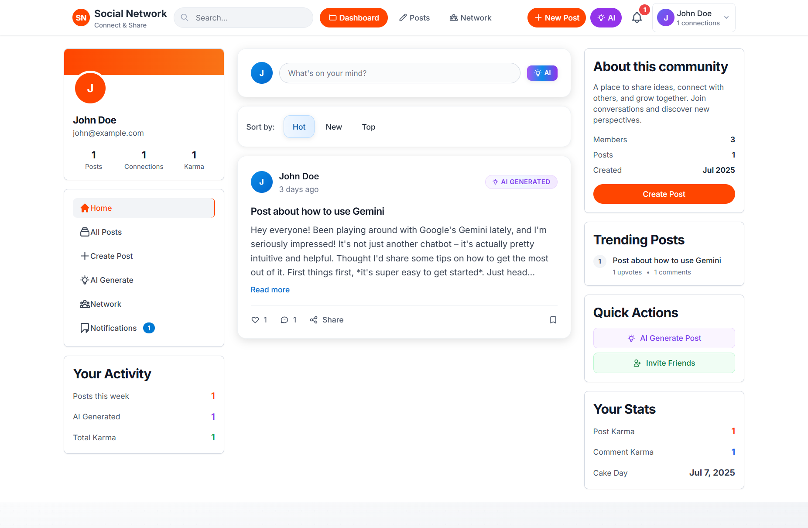

# Social Network Setup Guide



A modern Laravel-based social network with AI-powered post generation, user connections, and real-time interactions.

## 📋 Prerequisites

Before you begin, ensure you have the following installed on your system:

- **PHP** >= 8.2
- **Composer** (PHP package manager)
- **Node.js** >= 18.x and **npm**
- **MySQL** or **PostgreSQL** database
- **Git**

## 🚀 Installation Steps

### 1. Clone the Repository

```bash
git clone <repository-url>
cd social-network-2si
```

### 2. Install PHP Dependencies

```bash
composer install
```

### 3. Install Node.js Dependencies

```bash
npm install
```

### 4. Environment Configuration

1. Copy the environment file:
```bash
cp .env.example .env
```

2. Generate application key:
```bash
php artisan key:generate
```

3. Configure your `.env` file with your database credentials and other settings:

```env
APP_NAME="Social Network"
APP_ENV=local
APP_KEY=base64:your-generated-key
APP_DEBUG=true
APP_URL=http://localhost:8000

DB_CONNECTION=mysql
DB_HOST=127.0.0.1
DB_PORT=3306
DB_DATABASE=social_network
DB_USERNAME=your_username
DB_PASSWORD=your_password

# AI Configuration (Google Gemini)
GOOGLE_GEMINI_API_KEY=your_gemini_api_key

# Mail Configuration (optional)
MAIL_MAILER=smtp
MAIL_HOST=mailhog
MAIL_PORT=1025
MAIL_USERNAME=null
MAIL_PASSWORD=null
MAIL_ENCRYPTION=null
MAIL_FROM_ADDRESS="hello@socialnetwork.com"
MAIL_FROM_NAME="${APP_NAME}"
```

### 5. Database Setup

1. Create the database:
```bash
# MySQL
mysql -u root -p
CREATE DATABASE social_network;
exit
```

2. Run migrations:
```bash
php artisan migrate
```

3. Seed the database (optional):
```bash
php artisan db:seed
```

### 6. Build Frontend Assets

```bash
npm run build
```

For development with hot reloading:
```bash
npm run dev
```

### 7. Start the Application

```bash
php artisan serve
```

The application will be available at: `http://localhost:8000`

## 🔧 Configuration Details

### AI Features (Google Gemini)

To enable AI post generation:

1. Get a Google Gemini API key from [Google AI Studio](https://makersuite.google.com/app/apikey)
2. Add it to your `.env` file:
```env
GOOGLE_GEMINI_API_KEY=your_gemini_api_key
```

### File Storage

The application uses local file storage by default. For production, configure cloud storage in `.env`:

```env
FILESYSTEM_DISK=public
```

Run the storage link command:
```bash
php artisan storage:link
```

## 🎯 Features

- **User Authentication** - Registration, login, email verification
- **User Profiles** - Customizable user profiles with avatars
- **Posts Management** - Create, edit, delete posts
- **AI Post Generation** - Generate posts using Google Gemini AI
- **Social Connections** - Send/accept friend requests
- **Likes & Comments** - Interactive post engagement
- **Real-time Notifications** - Toast notifications for actions
- **Modern UI** - Responsive design with Tailwind CSS
- **Search & Filtering** - Post sorting (Hot, New, Top)

## 🗂️ Project Structure

```
social-network-2si/
├── app/
│   ├── Http/Controllers/         # Application controllers
│   ├── Models/                   # Eloquent models
│   ├── Services/                 # Business logic services
│   └── Policies/                 # Authorization policies
├── database/
│   ├── migrations/               # Database migrations
│   └── seeders/                  # Database seeders
├── resources/
│   ├── views/                    # Blade templates
│   ├── js/                       # JavaScript files
│   └── css/                      # Stylesheets
├── routes/
│   ├── web.php                   # Web routes
│   └── auth.php                  # Authentication routes
└── public/                       # Public assets
```

## 🚀 Development Workflow

### Running in Development Mode

1. Start the PHP development server:
```bash
php artisan serve
```

2. Start Vite for hot reloading (in a separate terminal):
```bash
npm run dev
```

3. Watch for file changes:
```bash
php artisan queue:work  # If using queues
```

### Building for Production

1. Optimize the application:
```bash
php artisan config:cache
php artisan route:cache
php artisan view:cache
```

2. Build optimized assets:
```bash
npm run build
```

## 🔍 Troubleshooting

### Common Issues

1. **Permission Issues**:
```bash
chmod -R 775 storage bootstrap/cache
```

2. **Database Connection Issues**:
   - Check your database credentials in `.env`
   - Ensure your database server is running
   - Verify the database exists

3. **Asset Build Issues**:
```bash
npm cache clean --force
rm -rf node_modules package-lock.json
npm install
npm run build
```

4. **Clear Application Cache**:
```bash
php artisan cache:clear
php artisan config:clear
php artisan route:clear
php artisan view:clear
```

### Debug Mode

Enable debug mode in `.env` for detailed error messages:
```env
APP_DEBUG=true
```

## 📚 Available Artisan Commands

```bash
# Database
php artisan migrate                 # Run migrations
php artisan migrate:fresh --seed    # Fresh migration with seeders
php artisan db:seed                 # Run seeders

# Cache
php artisan cache:clear             # Clear application cache
php artisan config:cache            # Cache configuration
php artisan route:cache             # Cache routes

# Development
php artisan tinker                  # Interactive PHP console
php artisan serve                   # Start development server
php artisan queue:work              # Process background jobs
```

## 🌐 API Endpoints

The application includes the following main routes:

- `GET /` - Landing page
- `GET /dashboard` - User dashboard
- `GET /posts` - Posts listing
- `GET /invitations` - Connection invitations
- `GET /ai-posts/create` - AI post generation
- Authentication routes under `/auth`

## 🔐 Security Features

- CSRF protection on all forms
- XSS protection with Blade templating
- SQL injection protection with Eloquent ORM
- Authentication middleware
- Authorization policies for posts and invitations

